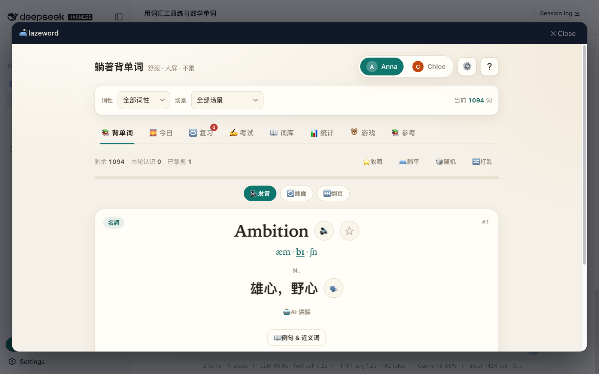

# 🛋️ lazeword (dsh-lazeword) — 躺着背单词

[中文](README.zh.md)

**lazeword** is a word-anchored bilingual learning system — **learning as simulation, trajectory as log**
(theory in [docs/learning-as-simulation.md](docs/learning-as-simulation.md)).

It grew from a real family need: a word-learning tool for a child starting school in Hong Kong —
one you can use lying down. From tokens as the entry point, to talking and creating with AI:
English has become a programming language, and vocabulary is its grammar.

- **Open foundation**: ships as a [DeepSeek Harness](https://github.com/deepseek-ai/deepseek-harness) (`dsh`, everything is a plugin) plugin; AI stories/explanations powered by DeepSeek (optional Cloudflare Worker keeps the key server-side; fully offline-capable)
- **Answers three questions of AI-era education**: what to learn — words are the interface to knowledge (15,000+ entries: official EDB math/science/geography + Oxford 5000 + Chinese classics + engineers' words + AI literacy); how to remember — FSRS-5 deterministic scheduling (Anki's parameter family, replayable trajectory); **what words are FOR — talking and creating with AI**: "The hottest new programming language is English" (Karpathy); the AI literacy pack (prompt / context window / describe / verify… plus papers, people and rules) teaches kids to communicate with AI — for good, and verifiably
- **Core engine = scenario-driven + data-driven** (modeled on autonomous-driving simulation): word = actor, sentence = scenario, trajectory = log, movie = scenario sequence — learning scenarios auto-generated from the child's own inputs and habits (see [docs/scenario-engine.md](docs/scenario-engine.md)); dsh's space-time determinism and the determinism required by AV simulation standards are the same thing
- **One file, zero dependencies**: a `dsh` web plugin that also runs standalone (a single HTML file); five games + AI tutor; biliteracy & trilingualism; one-click 繁/简
- **Adults and children are classmates in front of AI**: this is not a top-down education product — adults and children learn and experiment together (the AI-literacy pack's "verifiable doubt" applies to adults too). We don't know AI's "genetics" either — honest exploration here, no authoritative answers

## 30-second tour

🚀 **Try it now** (no install): https://xczhanjun.github.io/lazeword/ (GitHub Pages, single-file build; progress stays in your browser)

1. **Learn 5 words** — each card shows phonetics, morpheme breakdown, and the AI's real tokenization — see how an LLM reads words
2. **Open "🎓 Tutor"** — one lesson = diagnosis → lecture → practice → grading → written back into the memory schedule
3. **Open "🧹 Chores"** — pick a chore, write one English sentence, get praised by the AI teacher


## The name

**lazeword (躺着背单词) stays** — the name is the answer:

- **Laze is not laziness — it's an attitude toward AI: comfort and trust.** Lazy mode isn't about not studying; it's about letting learning happen in the most relaxed posture — good learning doesn't run on willpower, it runs on a system that remembers for you.
- **Word and token are the same thing**: token in Chinese is 词元 ("word-unit") — the engineering form of a word. A child memorizes words; put those words into an AI and they become tokens. English has become a programming language ("The hottest new programming language is English"), and vocabulary is its syntax and lexicon — memorizing words is accumulating tokens for creating with AI.

## Features

- **15,000+ curated words (two modes)** — **basic mode** by default: ~1,141 core words (947 everyday + HK subject/campus terms, fastest loading); opt into **advanced mode** for the full set: Oxford 5000 (KET/PET/FCE) + EDB math/science/geography + autodrive + Chinese classics (English ↔ 中文/繁體)
- **Spaced repetition (FSRS-5)** — adaptive scheduling in Anki's parameter family (state = fold(events)) + wrong answers auto-queued + event-sourced trajectory (deterministic, replayable)
- **6 quiz types** — meaning, word, IPA, listening, spelling (letter grid), cloze; wrong answers can be retried, correct answers auto-pronounce and auto-advance, combo-streak animation
- **Pronunciation** — English TTS + Cantonese + Putonghua read-aloud, IPA syllable & stress highlighting that follows the speech, repeat-after-me scoring
- **Word details** — example sentences, synonyms, etymology, root/affix hints (offline) + AI explanation (DeepSeek, optional)
- **AI articles** — 9 bilingual articles written from the word list (highlighted, clickable words) + AI turns today's learned/wrong words into a story
- **Reference** — 111 irregular verbs, 24 grammar points, 43 phrasal verbs, 50 conversational sentences
- **Five games** — space word-matching + memory flip + **letter tracing** (see the Chinese meaning, drag-connect letters on the grid to spell the word) + **word racing** (pseudo-3D road, steer into the right lane) + **word minesweeper** (classic rules + defuse mode: mines are your mistake-book words — answer their meaning to defuse them)
- **Family features** — up to 4 learner profiles, parent/teacher report, daily 10 words, JSON backup, study streaks, study heatmap
- **Lazy mode** — dark comfortable theme, big fonts, auto-pronounce + auto page-turn, voice control ("会 / 不会"), Space to pause
- **繁/简 switch** — one-click Traditional/Simplified for the whole UI
- **Anki ecosystem** — one-click TSV export + AnkiConnect sync + **review-log import** (one deterministic timeline across platforms)
- **Dictionary lookup** — any English word, even outside the library (phonetics/definitions/examples/synonyms/audio)
- **Shareable URLs** — the URL is the state: tabs, filters and reference pages update the address bar live, copy to share; deep links: `?user=anna&tab=quiz&scene=math&word=integer&ref=ai-chat&advanced=1`
- **Pronunciation settings** — Chinese entries default to Putonghua; optional Putonghua/Cantonese read-along on page turns; adjustable flip speed (slow by default)
- **Biliteracy & trilingualism** — English/Cantonese/Putonghua read-aloud, one-click 繁/简, Chinese classics pack (三字經/唐詩/論語)
- **🧑‍💻 People & Words** — learn vocabulary from legendary engineers' real code & docs (21 people in two groups: Engineering Legends / AI Scientists — antirez, Linus, Bellard, Knuth, Hamilton, Hopper, Turing, Hinton, Fei-Fei Li, Kaiming He, Andrew Ng… verified quotes, GitHub links), and meet the people behind them
- **🛡️ AI literacy & safety** — 64 AI-literacy terms + 12 milestone papers + a kid & parent AI handbook + **"Chat with AI" practice** (four-element prompt teaching, 5 templates — describe / story with my learned words / ask why / verify a claim / fix my sentence, library words auto-highlighted in replies)
- **🏭 Industrial manufacturing** — vehicle/machinery/factory terms (truck, diesel engine, transmission, piston, welding, assembly line…)
- **🎓 AI tutor** — one lesson = diagnosis (trajectory picks weak words) → lecture (AI, three-tier fallback) → practice (deterministic questions) → grading (AI grades your sentence) → done (written back into FSRS, schedule adapts); English + math, reproducible questions per child/day, degrades to a fully deterministic lesson with no AI
- **🛒 Ecosystem picks** — curated dsh plugins & skills in Settings (offline voice input, desktop pet, themes, memory stack, token panel) with one-click install commands and a third-party-code safety note
- **Fully offline** — one HTML file, zero dependencies (online only for example sentences / dictionary audio / AI features; optional Cloudflare Worker backend keeps the AI key server-side)

## Screenshots

Running inside DeepSeek Harness (real installation test):


The panel opens the full app (15,000+ words, fully offline):



## Why this design (theory)

- **The brain is a prediction machine**: learning = updating a predictive model (Rao & Ballard 1999; Friston 2010; Clark 2013)
- **Words are knowledge anchors**: 2,000 word families cover 87.8% of fiction / 89.4% of spoken English (Nation 2006); frequency follows a power law (Zipf 1949)
- **Forgetting is computable**: Ebbinghaus 1885 → FSRS (Ye et al., KDD 2022); retention R(t,S) is a deterministic prediction
- **Trajectory = simulation log**: event sourcing (Fowler 2005) + reproducible research (Buckheit & Donoho 1995)
- Full argument, references and product decisions: **[docs/learning-as-simulation.md](docs/learning-as-simulation.md)**; industry research: [docs/research-physics-simulation.md](docs/research-physics-simulation.md); **core engine (scenario-driven + data-driven): [docs/scenario-engine.md](docs/scenario-engine.md)**; **AI governance position & open-source history: [docs/ai-governance.md](docs/ai-governance.md)**; roadmap: [docs/roadmap.md](docs/roadmap.md); attributions & licenses: **[ATTRIBUTIONS.md](ATTRIBUTIONS.md)**

## Core design: dsh ecosystem & learning-as-simulation

lazeword shares dsh's philosophy — **everything is a plugin, everything is deterministic in space & time**:

| dsh concept | lazeword counterpart |
|---|---|
| Plugin mechanism | subject packs (math ships quiz-type code; geography/science/culture/autodrive are word packs), statically composed at build time, zero runtime loading |
| Event sourcing | learning trajectory (append-only log, 20k cap + deterministic compaction); state = fold(events), replayable bit-for-bit |
| Determinism | FSRS-5 scheduler (Anki's parameter family): retention R(t,S) is a deterministic prediction; seeded shuffles; golden-vector tests |
| Host interop | `/api/progress/:user` sync at boot, sharing one progress record with the dsh AI teacher |

**Anki ecosystem**: one-click TSV export (any Anki version) → AnkiConnect sync into a deck →
**review-log import** (Anki reviews join the same timeline) → FSRS shares Anki's parameters and algorithm.
Whether reviewing in lazeword or Anki, it is one deterministic learning trajectory.

Theory (predictive processing, Nation's coverage data, the FSRS paper) and product decisions:
[docs/learning-as-simulation.md](docs/learning-as-simulation.md); industry research:
[docs/research-physics-simulation.md](docs/research-physics-simulation.md).

## Install on DSH Desktop (recommended for families)

[DeepSeek Harness Desktop](https://github.com/anywhere-labs/deepseek-harness-desktop) (macOS / Windows, no Node required) wraps dsh into a native desktop app. Two steps:

1. Download and launch [DSH Desktop](https://www.deepseekdesktop.com) (`dshdesktop.cn` / `deepseekdesktop.com`)
2. Tray → **Open DSH Terminal** → run:

```sh
dsh plugin add dsh-lazeword   # once published to npm; or install from a local path: dsh plugin add /path/to/lazeword
```

Then **restart DSH Desktop** (so the new bundle enters the Loader composition) — the 🛋️ lazeword button appears in the sidebar.
The desktop exposes `desktopProfiles` / `desktopPnpm` plugin services; lazeword is a regular dsh plugin and works out of the box in compatibility mode.

## Install as a dsh plugin

```sh
dsh plugin --profile web add dsh-lazeword
```

Then look for **🛋️ 躺着背单词** in the sidebar. The panel opens the standalone app
inside the harness (blob-URL iframe — no server, no network, deterministic).

## Run standalone

Open [`app/lazeword.html`](app/lazeword.html) directly in any browser (double-click).


Or serve it for phones on the same LAN:

```sh
python3 -m http.server 8000
# open http://<your-ip>:8000/app/lazeword.html
```

## Cloud deployment (optional)

A Cloudflare Worker backend ships in the repo (`worker/index.js`): hosts the DeepSeek key server-side,
AI-story endpoint, and a dictionary proxy (rate-limited, input-sanitized).

```bash
npx wrangler secret put DEEPSEEK_API_KEY   # paste your DeepSeek key
npx wrangler deploy                        # deploys to workers.dev; bind a custom domain via wrangler routes
# static site: enable [site] in wrangler.toml pointing at ./app to serve on the same origin
```

Serve `app/lazeword.html` from the same origin (or via the dsh host) to unlock AI stories and dictionary lookup.

## Develop

Requires Node ≥ 22.19. Zero npm dependencies (tests use the built-in `node:test`).

```sh
npm test                          # unit tests (core functions)
node scripts/build.mjs             # build the standalone app
node scripts/build-client.mjs      # embed the app into the dsh client bundle
npm run check                     # syntax-check plugin entrypoints
```

## Architecture

```
src/core.mjs        deterministic pure core (single source of truth):
                    SRS scheduling, IPA syllable/stress parsing,
                    orthographic syllabification, grading, seeded RNG,
                    event log (append-only learning trajectory)
app/template.html   the app UI shell (__CORE__ / __WORDS__ markers)
data/*.json         word lists (Vocabineer 947 + HK subjects)
lib/index.js        dsh host entry (plugin registration)
lib/client.js       dsh web client bundle (embeds the app; generated)
scripts/            build + extraction tooling
tests/              node:test unit tests (20 assertions, zero deps)
```

Design principles: **deterministic, offline, auditable** — the app is statically
composed at build time (no runtime plugin loading), and the core event log makes
the whole learning trajectory reproducible ("spatiotemporal determinism").

## License

[MIT](LICENSE)

## Disclaimer

DeepSeek Harness is in developer preview and may introduce breaking changes.
This plugin is community-maintained and not affiliated with DeepSeek.
