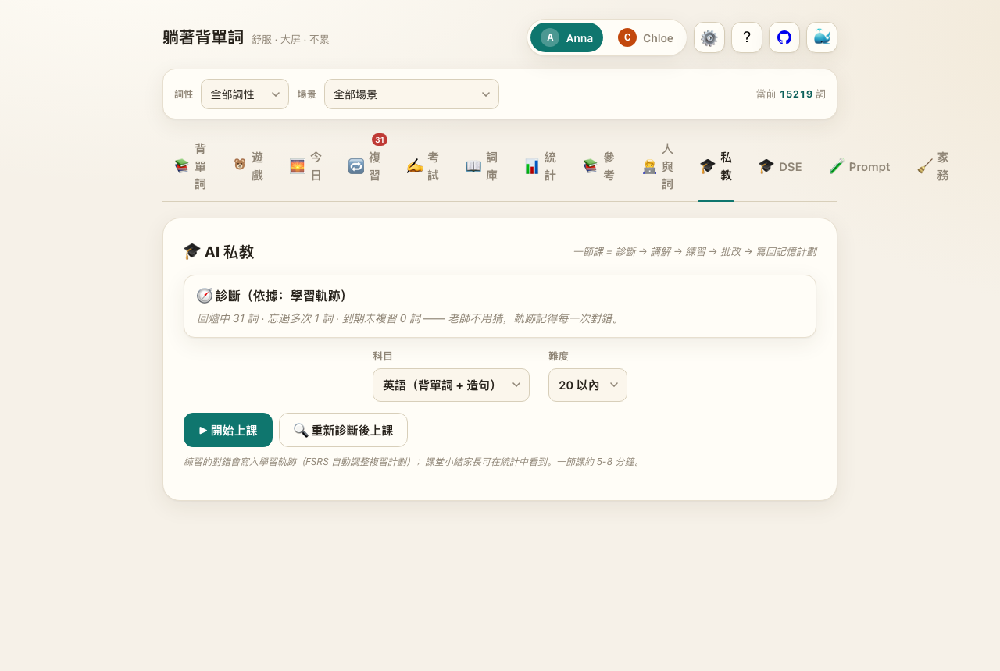
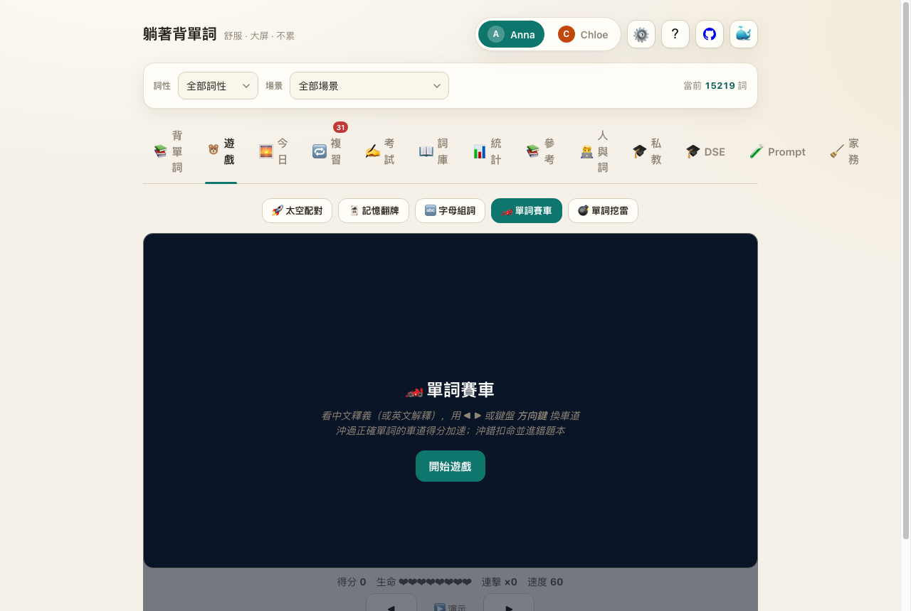
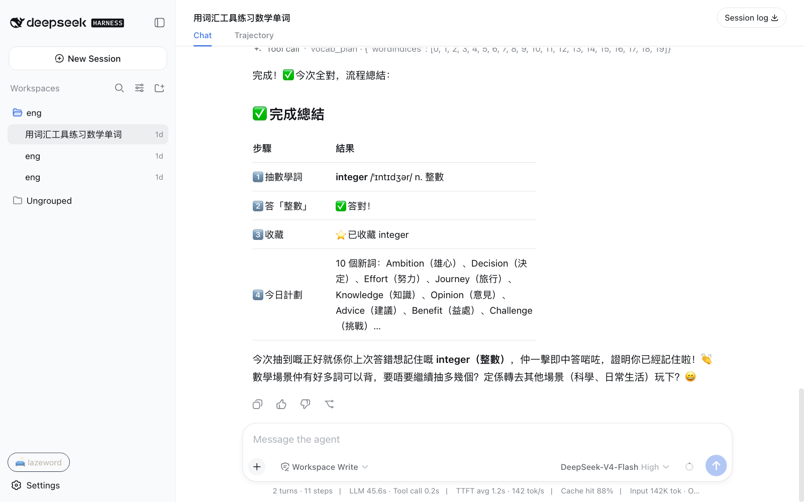
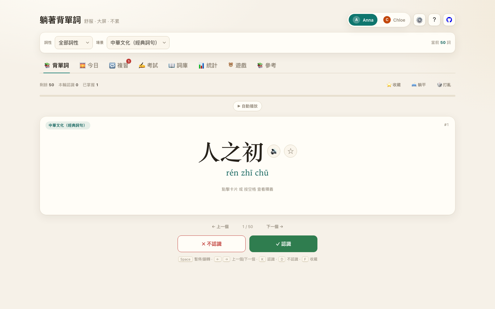

# 🛋️ lazeword (dsh-lazeword) — 躺着背单词

[English](README.md) · 中文

> **語言慣例**：README.zh 為簡體、應用界面為繁體、docs/ 以繁體為主——有意為之（香港語境，兩文三語）。

**lazeword（躺着背单词）**是一个以词汇为锚点的双语学习系统——**学习即仿真，轨迹即日志**
（理论基础见 [docs/learning-as-simulation.md](docs/learning-as-simulation.md)）。

它源于一个真实的家庭需求：为来到香港读书的孩子，做一个能躺着用的单词学习工具——
从词元（token）入门，到与 AI 对话与共创。英语已经变成了编程语言，词汇是它的语法。

- **底座开源**：作为 [DeepSeek Harness](https://github.com/deepseek-ai/deepseek-harness)（`dsh`，一切皆插件）插件发行，AI 故事/讲解由 DeepSeek 驱动（可选 Cloudflare Worker 托管 key，完全离线可运行）
- **回答 AI 时代教育的三个问题**：学什么——词汇是知识的接口（15,000+ 词：EDB 官方数学/科学/地理 + Oxford 5000 + 中华文化 + 工程师之词 + AI 素养）；怎么记住——FSRS-5 确定性调度（与 Anki 同参数体系，轨迹可重放）；**学了单词做什么——与 AI 对话与共创**：「The hottest new programming language is English」（Karpathy）；AI 素养 pack 含 prompt/context window/describe/verify 等对话词条、论文、人物与守则四层，教孩子**向善地、可验证地与 AI 交流**
- **核心引擎 = 场景驱动 + 数据驱动**（对标自动驾驶仿真）：词 = 实体，句子 = 场景，轨迹 = 日志，电影 = 场景序列——按孩子的输入与习惯自动生产个性化学习场景（见 [docs/scenario-engine.md](docs/scenario-engine.md)）；dsh 的底层时空一致性与自动驾驶仿真的确定性要求同源
- **单文件零依赖**：既是 `dsh` 网页插件，也可独立运行（一个 HTML 文件）；五个小游戏 + AI 私教；两文三语；繁/简一键
- **大人和孩子在 AI 面前是同學**：这不是居高临下的教育产品——成人和孩子一起学、一起实验（AI 素养 pack 的「可验证的怀疑」对大人同样适用）。我们也不知道 AI 的「基因学」是什么——这里只有诚实的探索，没有权威答案

## 30 秒导览

🚀 **立即体验**（免安装 demo）：https://xczhanjun.github.io/lazeword/（GitHub Pages 托管单文件版；进度存浏览器本地）

1. **背 5 个词**——卡片上有音标、词素拆解和 AI 实际分词（token）——你会看到 LLM 怎么读词
2. **点「🎓 私教」**——一节课 = 诊断 → 讲解 → 练习 → 批改 → 写回记忆计划
3. **点「🧹 家務」**——选一件家务、用英语写一句，AI 老师点评






## 名字

**「躺着背单词」不改名**——这个名字本身就是答案：

- **laze 不是懒，是一种和 AI 相处的态度**：舒适、信任。躺平模式不是不学，而是让学习发生在最放松的姿势里——好的学习不靠意志力的紧绷，靠系统替你把该记住的记住。
- **单词和词元是同一个词**：token 的中文叫「词元」——词元就是词的工程化形态。孩子背的是单词；把这些词放进 AI 的时候，它们就是词元。英语已经变成了编程语言（"The hottest new programming language is English"），词汇就是这门语言的语法和词法——背单词，就是在为和 AI 共创积累词元。

## 功能

- **15,000+ 精选词条（两级模式）** —— 默认**基础模式**约 1,141 个核心词（947 日常高频 + 香港学科/校园，加载最快）；设置开启**高级模式**进入全词表：Oxford 5000（KET/PET/FCE）+ EDB 官方数学/科学/地理 + 自動駕駛 + 中華文化（英文 ↔ 中文/繁體）
- **间隔重复（FSRS-5）** —— 自适应调度：自动安排每个词的复习时机（和 Anki 同一套算法）+ 错题自动进复习队列 + 学习轨迹（每次学习都记一笔，可重放、可审计——家长看得见孩子学过什么、错在哪里）
- **6 种题型** —— 看词选义、看义选词、看音标选词、听音选义、格子拼写、例句填空；答错可返回重选，答对自动发音自动下一题，连击动画
- **发音** —— 英语 TTS + 粤语 + 普通话三语朗读、IPA 音节与重音高亮跟随朗读、跟读打分
- **单词详情** —— 例句、近义词、词源、词根/词缀拆解（离线）+ AI 讲解（DeepSeek，可选）
- **AI 文章** —— 9 篇词库词汇编写的双语文章（词高亮可点）+ AI 把今天学过/背错的词自动写成故事
- **参考** —— 111 个不规则动词、24 条语法、43 个动词搭配、50 句常用句型
- **五个小游戏** —— 太空单词配对 + 记忆翻牌 + **字母組詞**（看中文释义，在字母格里拖拽连线拼出单词）+ **单词赛车**（伪3D 道路、看释义选车道）+ **单词挖雷**（扫雷规则 + 拆雷版：雷=错题词，踩雷须答对释义才能拆除）
- **家庭功能** —— 最多 4 个学习档案、家长/老师学习报告、每日 10 词、JSON 备份、连续打卡、学习热力图
- **躺平模式** —— 深色护眼主题、大字、自动发音 + 自动翻页、语音控制（说「会 / 不会」）、空格暂停
- **繁/简切换** —— 整个界面一键切换繁體/简体
- **Anki 生态** —— TSV 一键导出 + AnkiConnect 一键同步 + **复习记录导入**（跨平台同一条确定性时间线）
- **字典查询** —— 词库外任意英文单词可查（音标/释义/例句/近义词/真人发音）
- **链接分享** —— URL 即状态：切换 tab/筛选/参考页时地址栏实时更新，复制即可分享；深链直达 `?user=anna&tab=quiz&scene=math&word=integer&ref=ai-chat&advanced=1`
- **发音设置** —— 中文词条默认普通话；翻页可加读普通话/粤语；翻页速度三档可调（默认慢速舒适）
- **两文三语** —— 英中粵三语朗读、繁/简一键切换、中华文化经典词条（三字经/唐诗/论语）
- **🧑‍💻 人與詞** —— 从开源大神的真实代码与文档中学单词（21 位人物分「工程傳奇 / AI 科學家」两组：antirez、Linus、Bellard、Knuth、Hamilton、Hopper、Turing、Hinton、李飛飛、何愷明、吳恩達…真实引文 + GitHub 直达），顺便认识写下它们的人
- **🛡️ AI 素養與安全** —— 64 个 AI 素养词汇 + 12 篇里程碑论文 + **给孩子与家长的 AI 守则** + **「與 AI 對話」练习区**（四要素提示教学、5 个模板——描述/用我学过的词讲故事/问为什么/检查说法/改句子、AI 回复中词库词自动高亮）
- **🏭 工業製造** —— 汽车/机械/工厂词汇（卡车、柴油机、变速箱、活塞、焊接、装配线…）
- **🎓 AI 私教** —— 一节课 = 备课（轨迹诊断挑薄弱词）→ 讲课（AI 讲解三级降级）→ 练习（确定性出题）→ 批改（AI 批造句）→ 下课（写回 FSRS，自动调整复习计划）；英语 + 数学双科，同人同日同课题目可复现，无 AI 时降级为纯确定性课堂
- **🛒 生態推薦** —— 设置内精选 dsh 生态互补插件与 skills（离线语音输入、桌面宠物、主题、记忆栈、用量面板），安装命令一键复制，附第三方代码安全提示
- **完全离线** —— 单文件零依赖（例句/真人发音/AI 功能需联网，可选 Cloudflare Worker 后端托管 AI key）

## 为什么这样做（理论基础）

- **大脑是预测机器**：学习 = 修正预测模型（Rao & Ballard 1999；Friston 2010；Clark 2013）
- **word 是知识锚点**：2,000 词族覆盖小说 87.8%、口语 89.4%（Nation 2006）；词频幂律（Zipf 1949）
- **遗忘可计算**：Ebbinghaus 1885 → FSRS（Ye et al., KDD 2022），保留率 R(t,S) 是确定性预测
- **轨迹 = 仿真日志**：事件溯源（Fowler 2005）+ 可复现研究（Buckheit & Donoho 1995）
- 完整论证、引用与产品决策记录：**[docs/learning-as-simulation.md](docs/learning-as-simulation.md)**；行业调研：[docs/research-physics-simulation.md](docs/research-physics-simulation.md)；**核心引擎（场景驱动+数据驱动）：[docs/scenario-engine.md](docs/scenario-engine.md)**；**AI 治理立场与开源史：[docs/ai-governance.md](docs/ai-governance.md)**；**太空 AI 愿景（向善的最终章）：[lightrope/vision](https://github.com/lightrope/vision)**；路线图：[docs/roadmap.md](docs/roadmap.md)；**有趣观察与外部资料志：[docs/observations.md](docs/observations.md)**；署名与许可：**[ATTRIBUTIONS.md](ATTRIBUTIONS.md)**

## 核心设计：dsh 生态与「学习即仿真」

lazeword 与 dsh 共享同一套哲学——**一切都是插件，一切都有时空确定性**：

| dsh 概念 | lazeword 对应 |
|---|---|
| 插件机制 | 学科 packs（数学含题型代码、地理/科学/文化/自动驾驶为词条包），构建时静态组合，零运行时加载 |
| 事件溯源 | 学习轨迹（append-only 事件日志，上限 2 万 + 确定性压缩），状态 = fold(事件)，同一事件流可逐位重放 |
| 确定性 | FSRS-5 调度器（Anki 同参数体系）：R(t,S) 遗忘概率是确定性预测；种子洗牌、golden 向量测试 |
| 宿主互通 | 启动时 `/api/progress/:user` 双向同步，与 dsh AI 老师共享同一份学习进度 |

**Anki 生态兼容**：TSV 一键导出（任意 Anki 版本可导入）→ AnkiConnect 一键同步进指定牌组 →
**复习记录导入**（Anki 里的复习并入同一条轨迹时间线）→ FSRS 与 Anki 同参数同算法。
孩子无论在 lazeword 还是 Anki 复习，都是一条确定性学习轨迹。

完整理论基础（预测加工、Nation 词汇覆盖、FSRS 论文）与产品决策记录见
[docs/learning-as-simulation.md](docs/learning-as-simulation.md)；
行业调研见 [docs/research-physics-simulation.md](docs/research-physics-simulation.md)。

## 在 DSH Desktop 桌面端安装（推荐给家庭用户）

[DeepSeek Harness Desktop](https://github.com/anywhere-labs/deepseek-harness-desktop)（macOS / Windows，免装 Node）把 dsh 装进原生桌面应用。
安装 lazeword 只需两步：

1. 下载并启动 [DSH Desktop](https://www.deepseekdesktop.com)（`dshdesktop.cn` / `deepseekdesktop.com`）
2. 托盘 → **Open DSH Terminal** → 执行：

```sh
dsh plugin add dsh-lazeword   # 需要 lazeword 已发布到 npm；或本地路径安装：dsh plugin add /path/to/lazeword
```

安装后**重启 DSH Desktop**（让新 bundle 进入 Loader 组合），侧边栏出现 🛋️ lazeword 按钮。
桌面端提供 `desktopProfiles` / `desktopPnpm` 两个插件服务，lazeword 作为普通 dsh 插件在兼容模式下开箱即用。

## 作为 dsh 插件安装

```sh
dsh plugin --profile web add dsh-lazeword
```

安装后在侧边栏点击 **🛋️ 躺着背单词**，面板会在 harness 内以 blob-URL iframe 打开独立 App
（无需服务器、无需联网、行为确定）。

## 独立运行

直接双击打开 [`app/lazeword.html`](app/lazeword.html)（任意浏览器）。


手机同局域网访问可起一个静态服务：

```sh
python3 -m http.server 8000
# 打开 http://<你的IP>:8000/app/lazeword.html
```

## 云端部署（可选）

仓库自带 Cloudflare Worker 后端（`worker/index.js`）：托管 DeepSeek key、AI 故事接口、词典代理（含限流与输入净化）。

```bash
npx wrangler secret put DEEPSEEK_API_KEY   # 输入你的 DeepSeek key
npx wrangler deploy                        # 部署为 workers.dev；绑定自定义域用 wrangler routes
# 静态站点可同域托管：wrangler.toml 里打开 [site] 指向 ./app
```

部署后把 `app/lazeword.html` 与 worker 同域（或通过 dsh 宿主）访问，即可获得完整的 AI 故事与词典能力。

## 发布检查清单

- `npm test`（67 测试）+ `python3 scripts/check-packs.py`（pack 质量门）+ `node scripts/build.mjs`（可复现构建 diff 为零）
- dsh 层叠验证：`dsh --profile web --dump-config | grep lazeword` 应显示插件已挂载
- `npm publish`（prepublishOnly 自动跑全量质量门）；ATTRIBUTIONS.md 与新增数据同步

## 开发

需要 Node ≥ 22.19。零 npm 依赖（测试用内置 `node:test`）。

```sh
npm test                          # 单元测试（核心函数）
node scripts/build.mjs             # 构建独立 App
node scripts/build-client.mjs      # 把 App 嵌入 dsh 客户端 bundle
npm run check                     # 语法检查插件入口
```

## 架构

```
src/core.mjs        确定性纯核心（单一事实源）：
                    SRS 调度、IPA 音节/重音解析、英文音节切分、
                    拼写判分、种子随机、事件日志（追加式学习轨迹）
app/template.html   App 界面外壳（__CORE__ / __WORDS__ 标记）
data/*.json         词库（Vocabineer 947 + 香港学科词）
lib/index.js        dsh 宿主入口（插件注册）
lib/client.js       dsh 网页客户端 bundle（内嵌 App，由脚本生成）
scripts/            构建与抽取工具
tests/              node:test 单元测试（20 项断言，零依赖）
```

设计原则：**确定、离线、可审计** —— App 在构建时静态组合（无运行时插件加载），
核心事件日志让整个学习轨迹可精确重现（「时空确定性」）。

## 许可

[MIT](LICENSE)

## 免责声明

DeepSeek Harness 处于开发者预览阶段，可能有破坏性变更。
本插件为社区维护，与 DeepSeek 无关。
